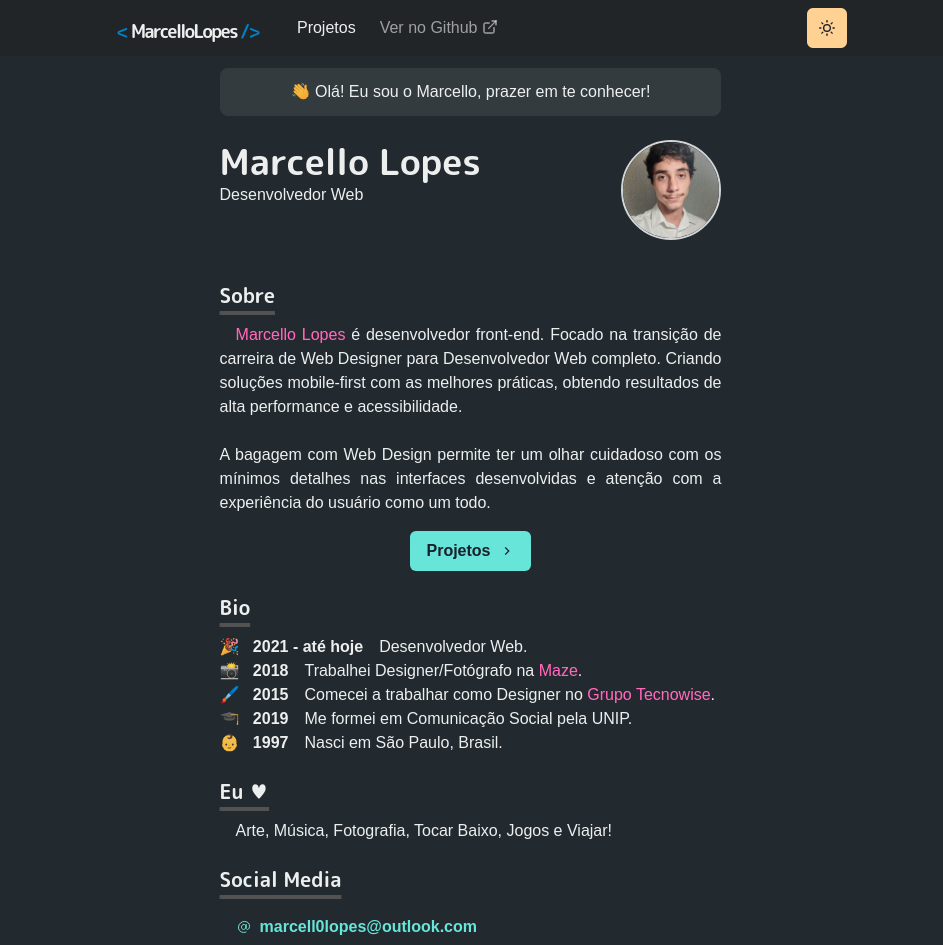

### e esse é o

# Meu portfolio! 👋

Utilizando Next JS e SSR para indexação no Google, construí meu portfolio de maneira minimalista e mobile-first onde o objetivo é trazer uma experiência leve e direta ao ponto, com animações leves na transição e carregamento de páginas com `framer-motion` e `chakra-ui` facilitando todo esse processo.

### 🖥 [Você pode ver meu portfolio nesse link]()

## 

Using NextJS and it's SSR, I've built my portfolio in a minimalist way and mobile-first, the objective was to give a clean experience and straight to the point, with eased-out animations between transictions. Used `framer-motion` and `chakra-ui` helped a lot during this process.

### 📱[You can see my portfolio in this link]()
